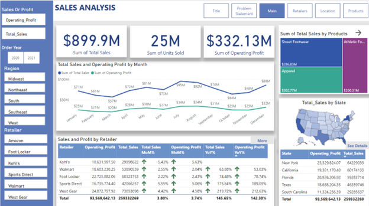
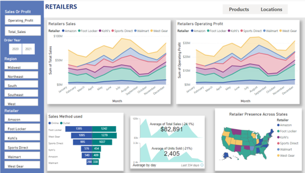
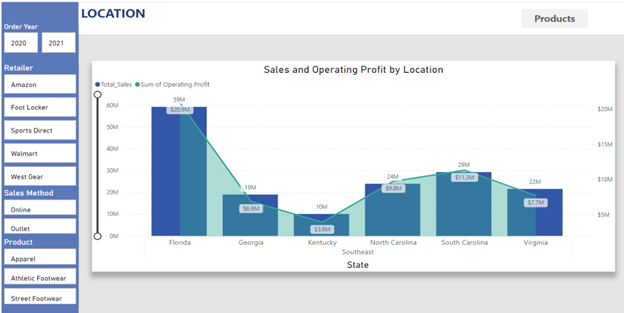
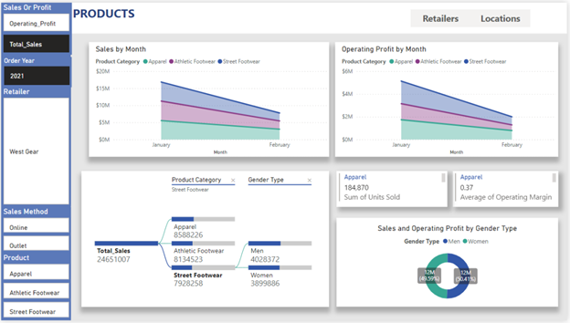

# AdidasSalesDashboard

Adidas Sales Analysis 2020-21 using PowerBI  
Check out the report for details.

## Dataset Used
[Adidas Sales Data](https://www.kaggle.com/datasets/vishwas199728/adidas-sales-data)

## Dashboards

### Main
- Overview of operating sales and profit.
- Filters for region, retailer, and year can be used.
- Drill-through feature enabled for all charts.
- 

### Retailers
- Retailer's performance across the US.
- 

### Location
- Sales and operating profit across different regions, states, or cities.
- 

### Product
- Insight into the company's top and worst-performing products.
- 

## Final Insights

1. **Total Sales and Profit**: Adidas made total sales of $899.9M and a profit of $332.13M between 2020 and 2021 with 25M total units sold.
2. **Top Retailer**: West Gear holds the highest number of sales, profit, and units sold among all the retailers.
3. **Lowest Performing Product**: Women's Athletic Footwear holds the last rank in both sales and profit.
4. **Highest Monthly Growth**: Kohl’s (Retailer) had the highest monthly growth indicating potential.
